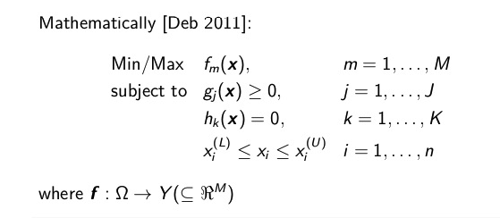
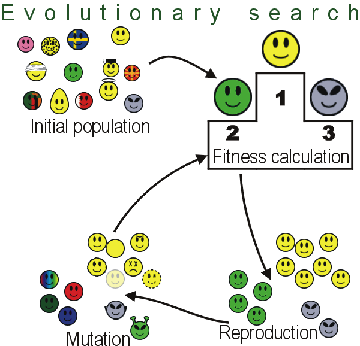
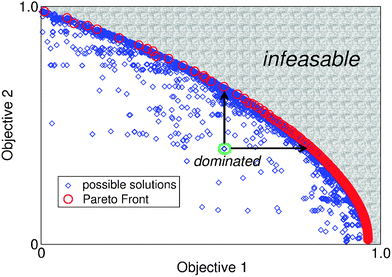
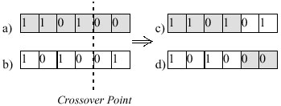
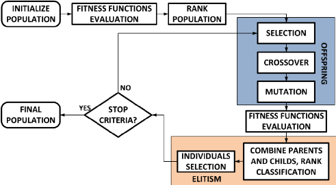

```{r setup, include = FALSE}
knitr::opts_chunk$set(fig.align='center') 
knitr::opts_chunk$set(echo = TRUE)
```

# Mono and Multi-Objective Optimization

Given a function from some set A to the real numbers, we want to find $x_{0}$ such $f(x_{0})$ $\leq$ $f(x)$ for all x in A (minimization problem). Such a formulation is called an optimization problem or a mathematical programming problem. 
Adding more than one objective to an optimization problem adds (multi-objective optimization) complexity. For example, consider profit and risk in trading. We can define multi-objective optimization (MOO) as follows: 

  <center></center>

# Evolutionary Algorithms

Evolutionary Algorithms (EAs) and, more specifically, Multi-Objective Evolutionary Algorithms (MOEAs) help us solving this type of problems. The next figure explains the basic schema for a EA.

<center></center>


The Pareto front or Pareto frontier is a paramount concept for these algorithms. The Parete front is the set of choices that are Pareto efficient. Pareto efficiency, or Pareto optimality, is a state of allocation of resources in which it is impossible to make any one individual better off without making at least one individual worse off.

  <center></center>

A solution is called nondominated, Pareto optimal, Pareto efficient or noninferior, if none of the objective functions can be improved in value without degrading some of the other objective values.

## Population and parameters

In genetic algorithms, a chromosome (also sometimes called a genotype) is a set of parameters which define a proposed solution to the problem that the genetic algorithm is trying to solve. The set of all solutions is known as the population.

In our case, we need to find the best coefficients and constant term. So, we have 18 coefficients + 1 constant term = 19 genes. 

```{r xtable, results='asis', echo = FALSE}
library(xtable)
tableGene <- function(){
  data <- matrix(c(" coef1 ", " coef2 ", " ... ", " b "), nr = 1)
  noquote(data)
  colnames(data) <- c(" Gene 1 ", " Gene 2 ", "... ", " Gene k ")
  tab <- xtable(data)
  return(tab)
}

print(tableGene(), type = "html", include.rownames = FALSE)
```

Setting up the best parameters is a hard and non trivial task. We can use previous experience, trial and error or, even, a optimization method to choose these values. In this exercise we are going to try several values. 

## Crossover and mutation

Next figure explains the one point crossover operator.

  <center></center>

Crossover basically simulates sexual genetic recombination (as in human reproduction) and there are a number of ways it is usually implemented in GAs. Probability of crossover is the probability that crossover will occur at a particular matching; that is, not all matching must reproduce by crossover.

Mutation probability (or ratio) is basically a measure of the likeness that random elements of your chromosome will be flipped into something else. For example if your chromosome is encoded as a binary string of length 100 if you have 1% mutation probability it means that 1 out of your 100 bits (on average) picked at random will be flipped.

The distribution index has a direct effect in controlling the spread of offspring solutions. If this parameter is large the offspring solutions are close to the parent solutions, if it's small the offspring solutions are away from the parent solutions. Distribution index for Crossover should be in the range (0, 20], while distribution index for mutation should be in the range (0, 50].

# Evolutionary algorithms using R

There are several EAs and MOEAs. One of the most well-known algorithms is NSGA-II.

  <center></center>

The \textit{mco} R package implements this algorithm. Install this package if not already present:

```{r, eval = TRUE}
list.of.packages <- c("mco")
new.packages <- list.of.packages[!(list.of.packages %in% installed.packages()[,"Package"])]
if(length(new.packages)) install.packages(new.packages)
```

Load the library
```{r, eval = TRUE, echo = TRUE}
library(mco)
# others
library(reshape2)
library(ggplot2)
```

And configure some parameters.

```{r, eval = TRUE}
#Number of evaluations
evaluations <- 100000
populationSize <- 100
#GENERATIONS!!! NOT evaluations
#neval = popsize x (generations + 1) from mco tutorial

#simple approximation
numberOfGenerations <- (evaluations/populationSize) 
```

## Implement the fitness function

Our aim is to obtain a lineal regression minimizing MSE. First, we say how to calculate MSE

```{r, echo = TRUE, eval = TRUE}
# MSE
CalculeMSEandR2 <- function (dataset){
  # We suppose Date in column 1, Real data in column 2 and Predicted data in column 3
  mse <- sum((dataset[, 3] - dataset[, 2])^2)/nrow(dataset)
  # R2
  mean_y <- mean(dataset[, 2])
  totalSumSquares <- sum((dataset[, 2] - mean_y)^2)
  residualSumSquares <- sum((dataset[, 2] - dataset[, 3])^2)
  r2 <- 1 - (residualSumSquares/totalSumSquares)
  return(list(mse = mse, r2 = r2, residuals = (dataset[, 3] - dataset[, 2])))
}
```

And now, we can specify the fitness function

```{r, echo = TRUE, eval = TRUE}
TestModelCaseMCO <- function (x, model, plot = FALSE) {
  
  # Always predict the second one
  testResults <- data.frame(model[[1]], model[2])
  colnames(testResults) <- c("Date", "Real")
  
  # There are no NAs in X
  # last one in x is b
  testResults <- cbind(testResults, Predicted = 
                         (rowSums(t(t(model[, 3:length(model)]) * as.double(x[1:length(x)-1])))) +
                         as.double(x[length(x)]))
  
  # index >= 0
  testResults$Predicted <- as.numeric(ifelse(testResults$Predicted < 0, 0, testResults$Predicted))
  
  if (plot) {
    print(ggplot(melt(testResults, id.vars = 'Date'), 
                 aes(x = Date, y = value, colour = variable, group = variable)) 
          + geom_line())

  }
  
  return(CalculeMSEandR2(testResults)$mse)
}
```

Execute the optimization process

```{r, echo = TRUE, eval = TRUE}
PerformNSGA2Regression <- function(model, test) {
  # 19 genes (18 coefficients + constant term)
  genes <- length(model) - 2 + 1
  time<- system.time(nsga2.model <- nsga2(TestModelCaseMCO, idim = genes, 
                                          odim = 1, # mono-objective 
                                          model, FALSE,
                                          generations = numberOfGenerations, 
                                          popsize = populationSize, 
                                          lower.bounds = rep(-10, genes), 
                                          upper.bounds=rep(10, genes), 
                                          cprob = 0.7, cdist = 20, mprob = 0.2, mdist = 20))
  
  print(time)
  
  # get best individual
  winner <- nsga2.model$par[1,]
  mse.winner <- nsga2.model$value[1,]
  
  # Plot winner
  testResults <- TestModelCaseMCO(winner, test, TRUE)
  
  return(list("winner" = winner, "mse" = mse.winner))
}

# Execute
training.set <- read.csv(file = "data/train.csv", header = TRUE, sep = ",", 
                         stringsAsFactors = FALSE)
test.set <- read.csv(file = "data/test.csv", header = TRUE, sep = ",", 
                         stringsAsFactors = FALSE)
PerformNSGA2Regression(training.set, test.set)
# try changing evaluations
```
